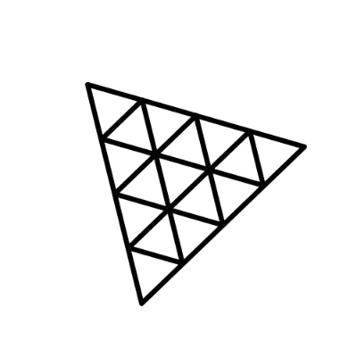

<h3 align="center">
    
</h3>

<h1 align="center"></h1>

<h3 align="center">
  L-Systems with Three.js 🌴
</h3>

  

  

  

  

  

  <a href="#rocket-sobre">Sobre</a>&nbsp;&nbsp;&nbsp;|&nbsp;&nbsp;&nbsp;
  <a href="#wrench-stack-e-tools">Stack utilizada</a>&nbsp;&nbsp;&nbsp;|&nbsp;&nbsp;&nbsp;
  <a href="#arrow-forward-execuçao">Execução</a>&nbsp;&nbsp;&nbsp;|&nbsp;&nbsp;&nbsp;
  <a href="#memo-licença">Licença</a>

## :rocket: Sobre

Bem vindos à nossa POC (Proof Of Concept) de uma simples aplicação para testar a poderosa matemática por trás do L-System, utilizando uma biblioteca 3D em JavaScript chamada **three.js**! :exploding_head:

Quem fez esse projeto acontecer:
- [Leandro Vieira](https://www.github.com/leandrovi)
- [Eduardo Alves](https://www.github.com/ed-leonardo)
- [Jonathan Citolino](https://www.github.com/Citolino)

Este desafio foi proposto pelo Prof. Mestre [Daniel Carvalho](https://github.com/danielscarvalho) na disciplina de Compiladores da **FTT**.

O objetivo do desafio era construir uma aplicação simples para representar o uso de L-System para construir uma árvore com várias ramificações :heart:

## :wrench: Stack e Tools

- [JavaScript](https://www.javascript.com/)
- [Three.js](https://threejs.org/)

## :arrow_forward: Execução

Para executar a aplicação, acesse a seguinte URL: https://leandrovi.github.io/l-system-3d/.

## :memo: Licença

Esse projeto está sob a licença MIT.

---

Feito com ♥ by [leandrovi](https://github.com/leandrovi) :wave: [Get in touch!](https://www.linkedin.com/in/leandrofv/)
